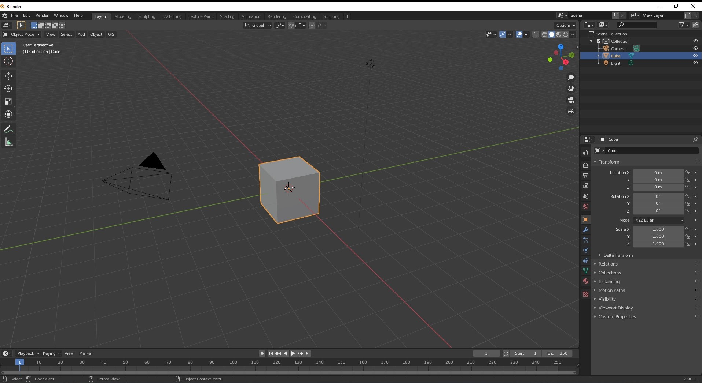
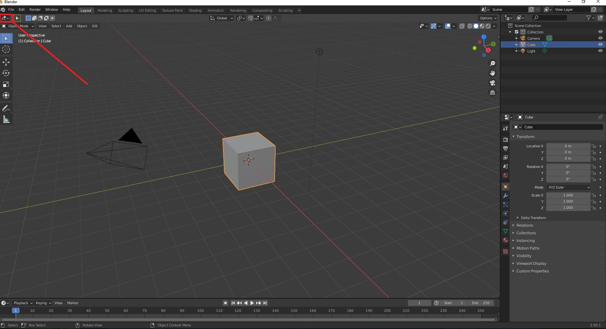
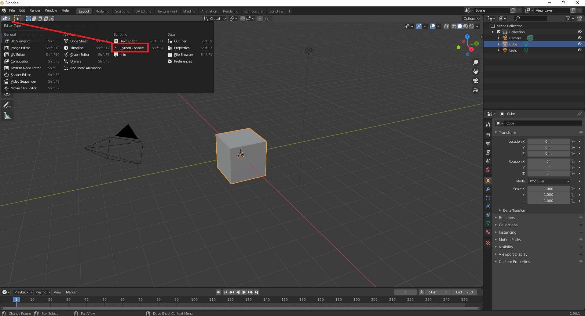
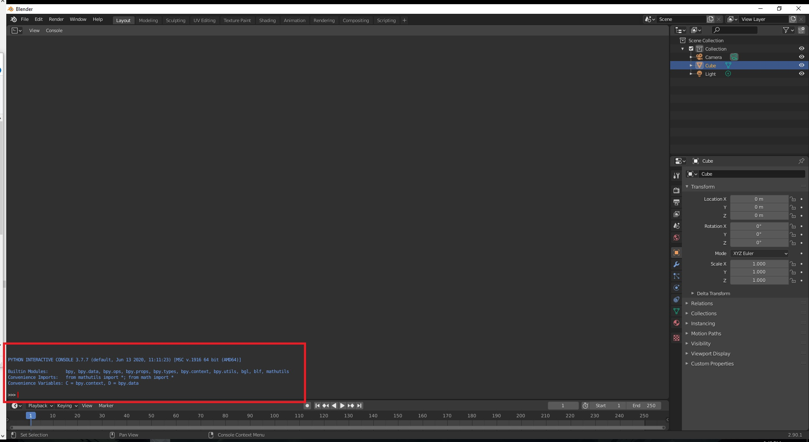
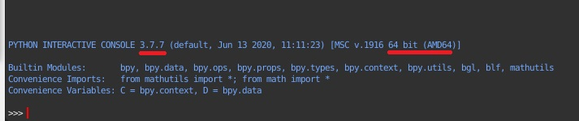
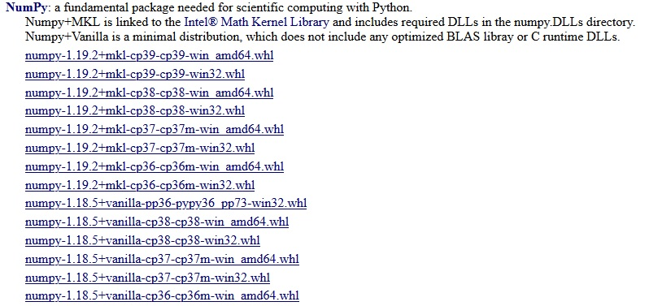

# Getting Earth Blender Running
---
Earth blender builds on the standard blender install with a few additonal dependancies.

## 1 - Installing Blender

Blender can be easily downloaded and installed from [here](https://www.blender.org/download/).
Once installed you'll need to launch blender. You'll be greeted with a screen like this.

From here you can select a different view port by clicking on the button below. 

This will display the options you have for viewports in blender. These views can be usefull for a host of tasks in blender. However for now we'll just be using the python console.

Blender comes packaged with a version of python which can change depending on your os and when you installed blender. We'll need to know two key details to install the python dependencies. By selecting the python console view we can send commands to the bundled python package!

 
 Take note of the numbers that appear hear on your blender version, they'll be needed in the next step.

---
## 2 - Download Python Dependencies

The version of python bundled with blender comes with some modules pre-installed.
Our plugin however uses some extra python modules we'll need to install.
Unfortunately this process can be a little tricky. 
To start we need to download 3 .whl install files.

 - [numpy](https://www.lfd.uci.edu/~gohlke/pythonlibs/#numpy) - a numerical python package
 - [gdal](https://www.lfd.uci.edu/~gohlke/pythonlibs/#gdal) - a co-ordinate management package
 - [rasterio](https://www.lfd.uci.edu/~gohlke/pythonlibs/#rasterio) - a raster processing package
 
 These links will lead to a website where these packages have been pre-prepared for us, the numpy example should look like this.
 
 
 
The naming convention can be confronting
 - cpXX is the python version in our example 3.7.7
 - win is the system architecture either 32 or 64
 
Thus we need numpy‑1.19.2+mkl‑cp37‑cp37m‑win_amd64.whl

Repeat this for gdal and rasterio, once you have all the whl files downloaded move onto the next step.

---
## 3 - Installing Python Dependencies

Navigate to the blender install directory where X.XX is the blender version number.

>C:\Program Files\Blender Foundation\Blender X.XX\X.XX\python\bin

When in this directory copy the downloaded files in.
Open a windows command prompt here, with administrative permissions.
Then run the following three commands, where the file name is replaced with your downloaded files:

>python.exe -m pip install NUMPY_FILENAME.whl

>python.exe -m pip install GDAL_FILENAME.whl

>python.exe -m pip install RASTERIO_FILENAME.whl

---
## 4 - Installing Earth Blender
