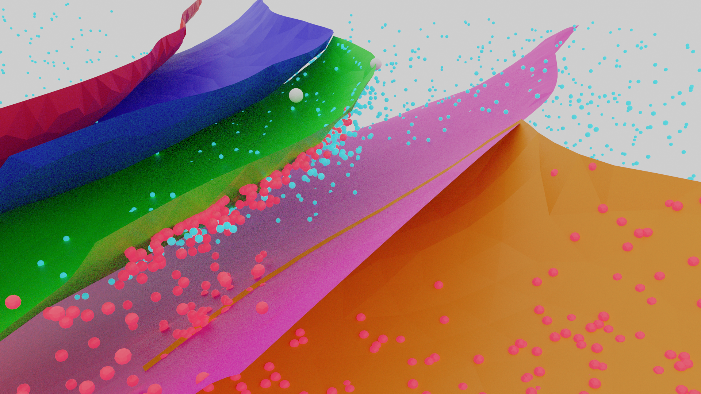

# Earth Blender
Helper files to use Blender for geoscience visualisation and integration.

* As a submission to the FAA-NGEA competition 2020, our "Team UWA" has prepared a number of methods for visualising geoscience data in Blender.
_____________

## Hillshades
In our *Hillshades* folder, you can learn to create rendered hillshades such as  

and

and  

__________

## Fluid Visualisation
These visualisations are simplistic examples of how real geological structures can be used to create compelling visualisations.  

The blend files provided can be used to generate higher resolution examples as well as to play around with fluid source and direction.  

